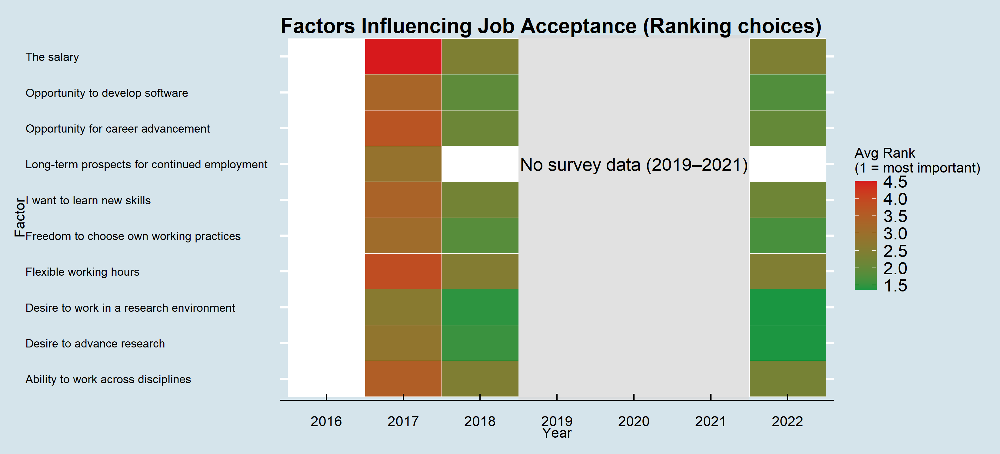

.](fig/career_choice.svg)

The RSE role is a relatively new and evolving role in the research ecosystem.
Many individuals may transition into RSE roles from other career paths, such as research, software development, or a combination of
both. Understanding the factors that influence individuals to move into RSE roles gives an idea into the motivations and aspirations of
RSEs, as well as inform strategies for attracting and retaining talent in this field. In this section, we analyse
the factors that influenced individuals to accept their position as an RSE.

## Data source and methodology

- The data for this analysis are collected from the code `prevEmp2` for the years 2017, 2018, and 2022.
- The period from 2019 to 2021 is not reported as the data for these years are not available.
- This code contains the responses to the survey question "Rank the following factors dependent on how strongly they influenced your decision to accept your current position".
- Using the R package `ggplot2`, the data are visualised in the form of a heatmap.
- The lower the rank, the more important the factor (denoted by green); the higher the rank, the less important the factor (denoted by red).
- The script for this analysis is available in the file
[rank_choice.R](https://github.com/SaranjeetKaur/RSE_historical_analysis/blob/main/src/rank_choice.R) of the repository.

## Key findings

The most influential factors for moving into RSE roles include:

- "Opportunity to develop software"
- "Freedom to choose own working practices" 
- "Desire to work in research environment" 
- "Desire to advance research"
