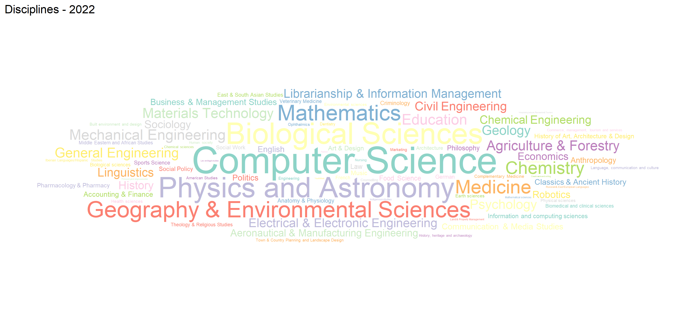

RSEs have a wide range of backgrounds and work in various disciplines. This section explores
the disciplines in which RSEs work (only for the year 2022), based on their responses to the survey.

## Data source and methodology

- The data for this analysis are collected from the code `currentEmp13` for the year 2022.
- This code contains the responses to the survey question "Please select the discipline in which you work".
- Using the R package `ggplot2` and `ggwordcloud`, the data are visualised in the form of a word cloud.
- The script for this analysis is available in the file [discipline.R](src/discipline.R) of the repository.

## Key findings

In 2022, some of the most popular disciplines where RSEs worked included Computer Science,
Geography and Environmental Science, Physics and Astronomy, Mathematics, to name a few. This reflects
the diversity of the RSE community and the wide range of research areas where RSEs contribute.
The word cloud also shows that there are many other disciplines where RSEs work, indicating the
interdisciplinary nature of RSE roles.
