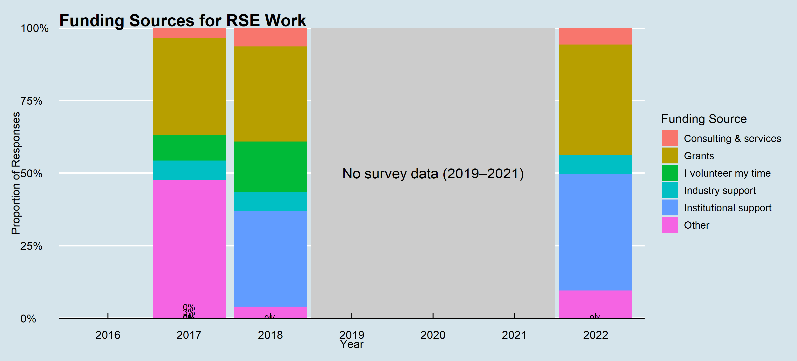

.](fig/funding.png)

## Data source and methodology

- The data for this analysis are collected from the code `fund2` for the years 2017, 2018, and 2022.
- The period from 2019 to 2021 is not reported as the data for these years are not available.
- This code contains the responses to the survey question "Which of the following sources are used to pay for your effort as an RSE?".
- Using the R package `ggplot2`, the data are visualised in the form of a stacked bar chart.
- Since there are multiple responses for this question, the categories reported include Grants",
"Institutional support", "Industry support", "Consulting & services", "I volunteer my time",
and every other source is classified as "Other".
- The script for this analysis is available in the file [fund.R](src/fund.R) of the repository.

## Key findings

Over the years, there has been a reduction in the time spent on volunteer basis by RSEs and an improvement in the
institutional support for their work.
