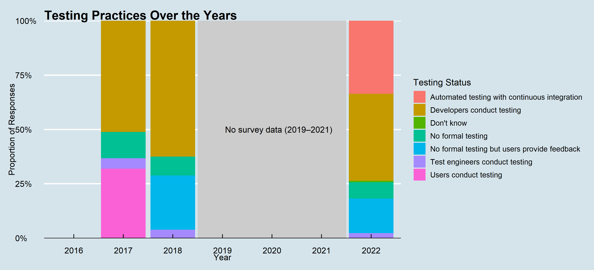

.](fig/continuous_integration.jpg)

Testing research software ensures that the software is reliable and reproducible.
It helps identify and fix bugs, improve code quality, and ensure that the software
meets the requirements of its users. In this section, we analyse how RSEs typically test
their software.

## Data source and methodology

- The data for this analysis are collected from the code `proj4can` for the years 2017, 2018, and 2022.
- The period from 2019 to 2021 is not reported as the data for these years are not available.
- This code contains the responses to the survey question "How are your projects typically tested? Please check all that apply".
- Using the R package `ggplot2`, the data are visualised in the form of a stacked bar chart.
- The script for this analysis is available in the file [proj4_test.R](src/proj4_test.R) of the repository.

## Key findings

Over the years there has been a shift from no formal testing or users testing the product to developers
conducting the test. Moreover, the 2022 data also reports the use of automated testing with continuous integration.
This denotes a healthy change towards using good software engineering practices.
