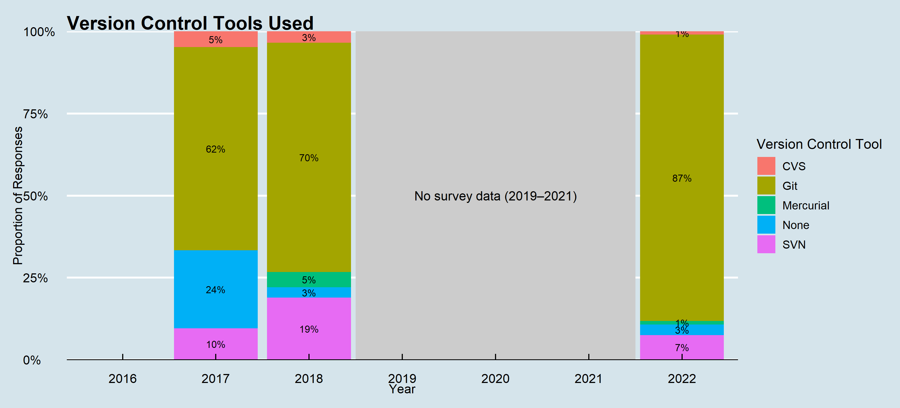

## Data source and methodology

- The data for this analysis are collected from the code `proj5` for the years 2017, 2018, and 2022.
- The period from 2019 to 2021 is not reported as the data for these years are not available.
- This code contains the responses to the survey question "Which version control tools do you use for software development?"
- Using the R package `ggplot2`, the data are visualised in the form of a stacked bar chart.
- The script for this analysis is available in the file [proj5_version.R](src/proj5_version.R) of the repository.

## Key findings

In 2017, 24% of the respondents reported of not using version control tools which reduced to 1% in 2022.
The most popular version control tool being "Git", with approximately 87% (in 2022) responses.
